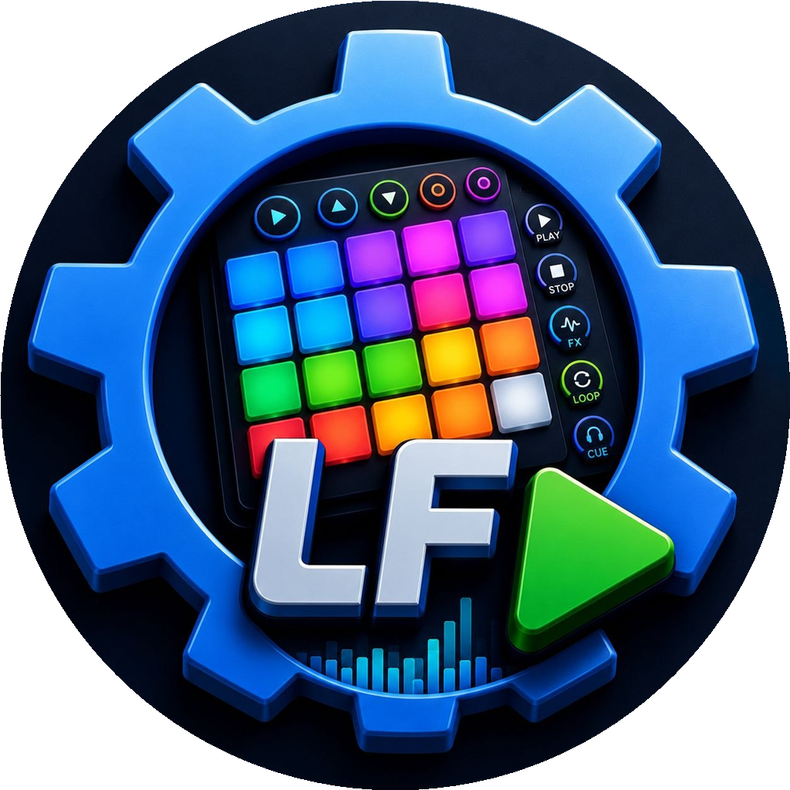

<div align="center">
  

  <h1>LF Botonera de Efectos</h1>

  <p><strong>Botonera profesional de efectos de sonido para radio, locución y streaming.</strong></p>

  <p>Dispara efectos, cortinas, identificaciones, locuciones y audios de apoyo en directo, con un motor nativo en Rust y una interfaz diseñada para la velocidad y el control total.</p>

  [](#descarga)
  [](#descarga)
  [](https://tauri.app/)
  [](https://www.rust-lang.org/)
  [](LICENSE)
  [](https://github.com/yosoyluisfernando/LF-Botonera-de-efectos/releases/latest)
  [](https://www.paypal.com/donate/?hosted_button_id=3JJVFFBVR4MQQ)
</div>

---

## ¿Qué es?

**LF Botonera de Efectos** es una aplicación de escritorio para disparar sonidos en vivo con precisión y velocidad. Está pensada para locutores, emisoras de radio, operadores técnicos, productores, creadores de contenido y streamers que necesitan una botonera confiable y rápida durante una transmisión real.

Construida con **Tauri 2 + Rust**: el motor de audio es nativo, sin capas intermedias. La interfaz es ligera y toda la lógica crítica —reproducción, mezcla, análisis, base de datos— vive en el backend Rust.

También forma parte del ecosistema de [LF Automatizador](https://github.com/yosoyluisfernando/lf-automatizador). Ambas aplicaciones comparten formatos de archivo para que pestañas y perfiles puedan intercambiarse sin romper flujos de trabajo existentes.

---

## Descarga

La última versión estable está disponible en la página de releases:

**[→ Descargar LF Botonera de Efectos](https://github.com/yosoyluisfernando/LF-Botonera-de-efectos/releases/latest)**

| Sistema | Archivo recomendado | Descripción |
|---|---|---|
| Windows 10/11 | `LF.Botonera.de.Efectos_*_x64-setup.exe` | Instalador con asistente, para la mayoría de usuarios |
| Windows 10/11 | `LF.Botonera.de.Efectos_*_x64_en-US.msi` | Instalador MSI para entornos controlados o corporativos |
| Ubuntu / Debian | `LF.Botonera.de.Efectos_*_amd64.deb` | Paquete `.deb` para distribuciones basadas en Debian |
| Fedora / openSUSE | `LF.Botonera.de.Efectos_*_x86_64.rpm` | Paquete RPM para distribuciones compatibles |
| Linux universal | `LF.Botonera.de.Efectos_*_amd64.AppImage` | Ejecutable portable, sin instalación |

> **Windows:** requiere Windows 10 20H2 o posterior con WebView2 Runtime (incluido en Windows 11 y en versiones actualizadas de Windows 10).

---

## Características

### Organización

- **Perfiles ilimitados** para separar programas, clientes o proyectos distintos, cada uno con su propia configuración de audio.
- **Pestañas ilimitadas por perfil** con cuadrículas configurables (filas y columnas libres), nombres, colores y dispositivo de audio independiente por pestaña.
- **Colores personalizables** en cada botón y pestaña, con adaptación automática al tema claro u oscuro para mantener el contraste.

### Reproducción

- **Motor de audio nativo en Rust** (rodio + cpal) con mezcla simultánea de múltiples fuentes.
- **Modos de reproducción por botón:** bucle, superposición (multi-instancia), reiniciar al pulsar, detener otros al pulsar.
- **Modos globales de reproducción** aplicables a toda la sesión: Normal, Loop, Multi, Restart, y modo Solo (para todo al pulsar uno).
- **Botón Detener Todo** global.
- **Carpeta secuencial:** un botón puede reproducir archivos de una carpeta en orden, uno cada vez que se pulsa.
- **Locuciones dinámicas de hora:** botones que leen la hora actual del sistema y reproducen automáticamente la secuencia de archivos de audio correspondiente (por ejemplo: "son las", "catorce", "horas", "treinta", "minutos").
- **Locuciones dinámicas de clima:** botones que obtienen la temperatura y humedad actuales (vía open-meteo) y las locu­tan con los archivos de audio configurados.

### Atajos de teclado

- **Atajo por botón:** asigna una combinación de teclas a cualquier botón para dispararlo sin ratón.
- **Atajos de pestaña:** cambiar a una pestaña concreta con una tecla.
- **Atajos globales del sistema operativo:** Detener Todo, pestaña siguiente y pestaña anterior, activos incluso con la ventana en segundo plano.
- **Modo de mapeo visual:** muestra los atajos asignados sobre la rejilla en pantalla completa para tenerlos siempre a la vista.

### Pre-escucha

- **Salida de pre-escucha independiente:** enruta la escucha previa a un dispositivo de audio distinto (por ejemplo, unos auriculares) sin que el audio salga al aire.
- **Panel flotante** con nombre del audio, barra de progreso en tiempo real, temporizador, control de volumen y botón Stop.
- **Seek por clic** en la barra de progreso para adelantar o retroceder la previa al instante.

### Editor de pistas

- **Forma de onda profesional** dibujada en canvas: envolvente rellena estilo Adobe Audition, que refleja el volumen real aplicado y muestra en rojo las zonas que saturarían.
- **Punto de inicio (cue)** ajustable para saltarse silencios o colas, sin modificar el archivo original.
- **Punto de fin** opcional para recortar el final del audio.
- **Zoom** con slider (1×–30×) y Ctrl+Rueda, con scroll horizontal en el canvas.
- **Normalizador automático** al objetivo −14 LUFS (estándar de streaming) con techo de pico a −1 dBFS; activable por archivo.
- **Ajuste manual de ganancia** en dB sobre la normalización automática.
- **Análisis con progreso y caché persistente de waveform:** reabre pistas ya analizadas más rápido y evita recalcular la forma de onda cuando el archivo no cambió.
- **Transporte completo:** Play (reinicia si ya sonaba, sin duplicar), Stop cíclico (pausa → vuelve a la marca → vuelve a 0:00), reproducción desde el punto de cue, cursor de reproducción animado a 60 fps.
- **Ventana flotante (pop-out):** el editor puede sacarse como ventana independiente que se puede mover o minimizar.
- **Persistencia por archivo**, no por botón: edita un audio una vez y el cue y la ganancia se aplican en todos los botones que usan ese archivo.
- **Portabilidad en exports:** el cue y la ganancia viajan dentro de los archivos `.bdelf` / `.bdeplf` como campo opcional, para recuperarlos al importar en otro equipo.

### Precarga de audio en RAM

- **Caché LRU configurable** que predecodifica archivos de audio cortos en memoria RAM antes de que el usuario los pulse, eliminando el retardo del disco.
- **Tres estrategias:** perfil completo (carga todo al arrancar), pestañas visibles (solo la activa), o al reproducir (aprende qué se usa).
- **Presupuesto de RAM** configurable: 32, 64, 128 o 256 MB.
- **TTL configurable:** expulsa de la caché los archivos que llevan más de N horas sin reproducirse.
- **Seek O(1):** los audios cacheados permiten saltar al punto de cue de forma instantánea.

### Interfaz y experiencia

- **Tema claro, oscuro y automático** (según el sistema), sin parpadeo blanco al abrir.
- **Arrastrar y soltar** archivos desde el explorador directamente sobre cualquier botón.
- **Reordenamiento de botones** con Alt + arrastre.
- **Reordenamiento de pestañas** con arrastre.
- **Vúmetro estéreo L/R** en tiempo real en la barra inferior.
- **Reloj, fecha y contador regresivo** del último audio reproducido, en la barra inferior.
- **Historial undo/redo** de la configuración.
- **Asistente de primer arranque** para configurar el perfil, el dispositivo de audio y los módulos opcionales.
- **Aviso de actualización disponible** sin salir de la aplicación.
- **Recuperación automática** si el dispositivo de audio configurado no está disponible al iniciar.
- **Tamaño de texto de los botones** configurable (pequeño, normal, grande).

### Idiomas

Español · English · Português (Brasil) · Português (Portugal)

---

## Formatos de audio compatibles

MP3 · WAV · FLAC · OGG/Vorbis · OGG/Opus · AAC · M4A · AIFF

La decodificación se apoya en symphonia (decodificador puro Rust), sin depender de componentes propietarios de pago.

---

## Compatibilidad con LF Automatizador

LF Botonera de Efectos mantiene compatibilidad de formato con el LF Automatizador:

| Formato | Contenido |
|---|---|
| `.bdelf` | Una pestaña (paleta) de botones |
| `.bdeplf` | Un perfil completo con todas sus pestañas |

Los archivos exportados desde la Botonera pueden abrirse en el LF Automatizador y viceversa. Los campos exclusivos de cada aplicación se ignoran sin errores.

Los exports desde la Botonera incluyen opcionalmente el cue y la ganancia de cada audio (campo `bdelf_tracks`). El LFA los ignora; la Botonera los restaura al importar, adaptándolos a las rutas del equipo destino.

---

## Compilar desde el código fuente

### Requisitos

- [Node.js 20+](https://nodejs.org/) con npm incluido
- [Rust (rustup)](https://rustup.rs/) — toolchain `stable`
- Dependencias del sistema de [Tauri 2](https://tauri.app/start/prerequisites/)

### Windows

```powershell
npm install
npm run tauri build
```

### Linux (Ubuntu 22.04 / Debian 12 o compatible)

```bash
sudo apt-get update
sudo apt-get install -y \
  libwebkit2gtk-4.1-dev libssl-dev libgtk-3-dev \
  libayatana-appindicator3-dev librsvg2-dev \
  libasound2-dev libxdo-dev patchelf rpm squashfs-tools

npm install
npm run tauri build
```

Los instaladores quedan en `src-tauri/target/release/bundle/`.

### Modo desarrollo (con recarga en vivo)

```bash
npm run tauri dev
```

O simplemente haz doble clic en `DEV.bat`.

Abre la app con hot-reload del frontend. Los cambios en `src/` se reflejan al instante; los cambios en `src-tauri/src/` provocan recompilación automática de Rust.

---

## Publicación automática

Al publicar un tag con formato `v*` (por ejemplo `v1.1.2`), el workflow `.github/workflows/release-builds.yml` compila para Windows y Linux y publica los instaladores como assets del release.

La versión debe coincidir en estos tres archivos antes de publicar:

| Archivo | Campo |
|---|---|
| `package.json` | `"version"` |
| `src-tauri/Cargo.toml` | `version` en `[package]` |
| `src-tauri/tauri.conf.json` | `"version"` |

Ver [`Documentación/COMPILACION_Y_VERSIONES.md`](Documentación/COMPILACION_Y_VERSIONES.md) para el proceso completo y las notas sobre falsos positivos de antivirus.

---

## Estructura del repositorio

| Ruta | Descripción |
|---|---|
| `src/` | Frontend HTML, CSS y JS (Arquitectura en 3 capas: bridge, ui, util) |
| `src-tauri/src/` | Backend Rust (Arquitectura en 5 capas: core, model, engine, domain, ipc) |
| `src/public/i18n/` | Traducciones (es, en, pt-BR, pt-PT) |
| `Documentación/` | Documentación técnica y normas para contribuir |
| `.github/workflows/` | Pipelines de compilación y publicación automática |
| `DEV.bat` | Lanzador del modo desarrollo (doble clic) |

---

## Firma de Windows

Los instaladores de Windows no están firmados con certificado de desarrollador. Windows puede mostrar una advertencia al abrir el instalador por primera vez. El código fuente está disponible públicamente y el proyecto se distribuye bajo licencia libre.

---

## Comunidad y Contribuciones

¡Las contribuciones son bienvenidas! Este proyecto sigue los estándares de la comunidad de software libre para asegurar un entorno colaborativo y respetuoso.

| Documento | Descripción |
|---|---|
| **[Guía de Contribución](Documentación/CONTRIBUTING.md)** | Cómo empezar, reglas del código y cómo enviar un PR. |
| **[Código de Conducta](Documentación/CODE_OF_CONDUCT.md)** | Nuestras normas para mantener un ambiente profesional e inclusivo. |
| **[Política de Seguridad](Documentación/SECURITY.md)** | Cómo reportar vulnerabilidades de forma responsable. |

También puedes unirte a nuestros espacios de comunicación:

| Espacio | Enlace |
|---|---|
| Canal de información | [Entrar al canal](https://t.me/+XKof2wDvGVw1YTRh) |
| Grupo de comunidad | [Entrar al grupo](https://t.me/+bXppwWvJvSg5YjNh) |

---

## Apoyar el desarrollo

Si esta herramienta te resulta útil en radio, producción o streaming, puedes apoyar su mantenimiento:

**[Donar vía PayPal](https://www.paypal.com/donate/?hosted_button_id=3JJVFFBVR4MQQ)**

---

## Créditos de desarrollo

**Autor y creador:** Luis Fernando Velásquez

Este proyecto fue desarrollado con asistencia de herramientas de inteligencia artificial:

- **[Claude AI](https://claude.ai)** (Anthropic) — asistencia en arquitectura Rust, implementación del motor de audio, documentación técnica y revisión de código.
- **[Codex / GPT](https://openai.com)** (OpenAI) — asistencia en etapas iniciales del desarrollo.

Las herramientas de IA participaron como asistentes de desarrollo. El diseño del producto, las decisiones de arquitectura, la dirección creativa y la autoría del proyecto pertenecen al autor.

---

## Licencia

Copyright (C) 2026 **Luis Fernando Velásquez**.

Este programa es **software libre**: puedes redistribuirlo y/o modificarlo bajo los términos de la **Licencia Pública General de GNU GPL-3.0-or-later**.

Este programa se distribuye con la esperanza de que sea útil, pero **sin garantía alguna**. Consulta el archivo [LICENSE](LICENSE) para el texto completo.
